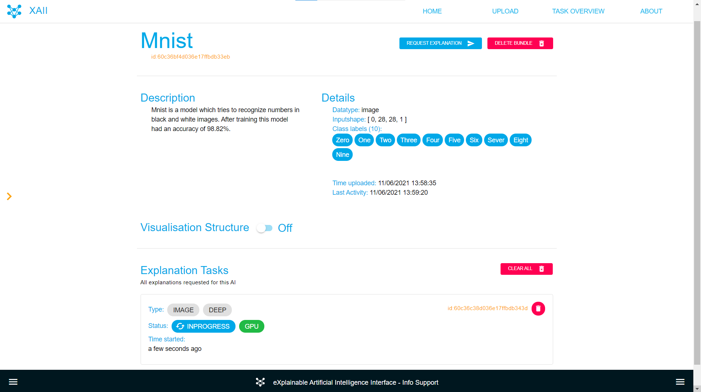

# Application user manual

## Introduction
XAI is an abbreviation for eXplainable Artificial Intelligence, a new and rising technology trend, which attempts to open the black box of typical AI models and explain their inner workings.

Besides a set of visualization methods and goals, it also offers a set of principles. To help developers make their Artificial Intelligence more transparent and trustworthy!

## What is SHAP
SHAP (SHapley Additive exPlanations) is a game-theoretic approach to explain the output of any machine learning model. It connects optimal credit allocation with local explanations using the classic Shapley values from game theory and their related extensions.

 SHAP assigns each feature an importance value for a particular prediction. The collective SHAP values can show how much each predictor contributes, either positively or negatively, to the target variable. Each observation gets its own set of SHAP values. This greatly increases its transparency. We can explain why a case receives its prediction and the contributions of the predictors. 

It is important to point out the SHAP values do not provide causality.

## Neural network support
The application is mainly built to work with Tensorflow Keras models. We also added support to other technologies by allowing ONNX models to be uploaded. ONNX is a toolkit that allows you to easily transform between neural net technologies. Seeing as not every technology is covered straight out of the box.

 If you want to upload a model of different technology, you will still have to do the ONNX conversion yourself. Note that there might be some compatibility issues that will prevent our application from being able to use your model.

## The application

### Home page 
On the home page there are three buttons available:
- Check our AI's: this will open the left sidebar which you can use to navigate to the information page of your neural networks.
- Upload your AI: This will redirect you to the upload form where you can upload neural networks with extra information.
- Read more: This button will redirect you to the about page where you can find information about the application.

### Upload your model
The first step is to explain your model is to upload your model. You can either select "Upload" on the navigation bar or use the button on the home page. 

Here you have to fill in the following fields:
- Name: Your ai bundle will be displayed using this name.
- Description: You can fill in some extra information about your model but it is not required.
- Model: Here you have to upload your model. It can either be a Tensorflow Keras model or an ONNX model!
- Data: You have to select which input data your model requires
- Training set: The explainers need some of the training data to be able to explain the model.
- Class names: This is helpful to show the names of the output classes in the explanation plots. This allows the results of the image plot to be ranked and only to show a select few. 

### Bundle information
After you uploaded your model, an ai bundle will be created and you will be redirected to the information page of your ai bundle. You can also navigate to your bundles by using the left sidebar. An overview of all the details about your bundle and a list of all tasks linked to this bundle will be shown. You can also request a visualisation of your model switching the toggle "Visualisation Structure".

### Request explanation
You can request an explanation by going to the information page of an ai bundle and pressing on the "Request explanation" button and this will redirect you to the request form. Depending on the type of input required for the model you will get a different form. These are the fields that all input types have in common:
- Identifier: This field is already filled in and shows the id of the bundle
- Data type: This is already filled in and shows the type of input required for the model
- Explanation type here you can select the explainer you want to use. For more information about the explainer please refer to the [Implemented Explainers](./implemented-explainers.md) wiki page.

Fields specific to image input type:
- Number of ranked explanations: This will decide whether you want to rank the results and the number of output classes shown. When put on 0, all results are shown and will not be ranked.
- Normalize data: The default setting of SHAP is to use one scale for all results. This can result in unclear results. That is why we added a function to normalize each result between -1 and 1.

 Fields specific to CSV input type:
- Plot type: When explaining CSV data, many plots are available. For each plot there is information and example plots available. All plot information can be found on the [Implemented Plots](./implemented-plots.md) wiki page.

When the explanation request is accepted, you will be redirected to your bundle page. The new task will be at the top of the task overview of your bundle. The status of the task will be frequently updated.

### Task overview
An overview of all explanation tasks can be found by clicking on "Task overview" in the navigation bar. All pending and in-progress tasks will be shown at the top and these can be canceled. After those, all finished and canceled tasks will be shown in chronological order. Tasks also get canceled when something goes wrong during the explanation process.

### About page
On the about page you can find information about the Application. There also is an explanation available on how explaining neural networks works and how you can interpret the results.

# Useful links
https://github.com/lrjball/shap/tree/docs_update
https://shap-lrjball.readthedocs.io/en/latest/index.html
https://towardsdatascience.com/explain-your-model-with-the-shap-values-bc36aac4de3d
https://coderzcolumn.com/tutorials/machine-learning/shap-explain-machine-learning-model-predictions-using-game-theoretic-approach